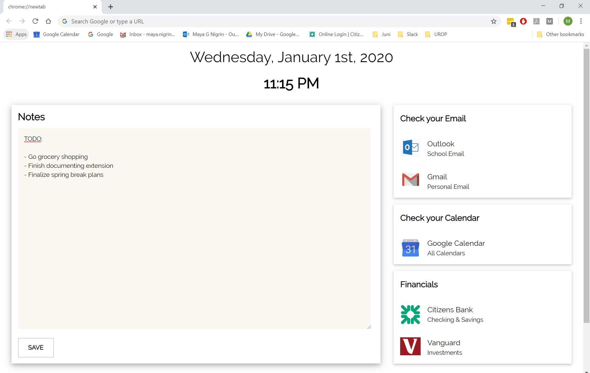

# Custom Chrome Extension

## Contents
* Overview
* How to use this extension
* Credit & other notes

## Overview
The code in this repository is for a custom-built Chrome extension that overrides the "new tab" page and instead shows an html page displaying the current date & time, useful links, and a notepad that can be edited and saved, meaning the notes persist even when the page is closed.

Here's an image of what the extension looks like:

## How to use this extension
If you'd like to use this extension for yourself, or perhaps use parts of it and modify the rest, here's how you will need to set it up.

First, clone this repository. If you'd like to change the links or make any other edits to the page, you will likely want to do that in either the `newTab.html` file or the `script.js` file. Once you've made your desired changes (if any), open Chrome and navigate to `chrome://extensions/`. Click the toggle in the upper-right corner marker "Developer Mode". You should then see three new buttons towards the top of your screen. Click "Load Unpacked", and then select the folder containing this repository. You can then turn off Developer Mode. Now, when you open up a new tab, you should see the customized page!

If you'd like to also make it so that Chrome opens up to this page, you can do that by navigating to `chrome://settings/defaultBrowser` and selecting "Open the New Tab page" in the "On Startup" section.

## Credit & other notes
Here are some sources I used to make this extension:
* https://eqdn.tech/html5-note-app-tutorial/
* https://www.w3schools.com/w3css/w3css_templates.asp
* https://www.w3schools.com/js/js_date_methods.asp

If you'd like to use or modify this code, please feel free! If you do end up making it somehow publicly available, please include a link to this repository or some other form of credit.

